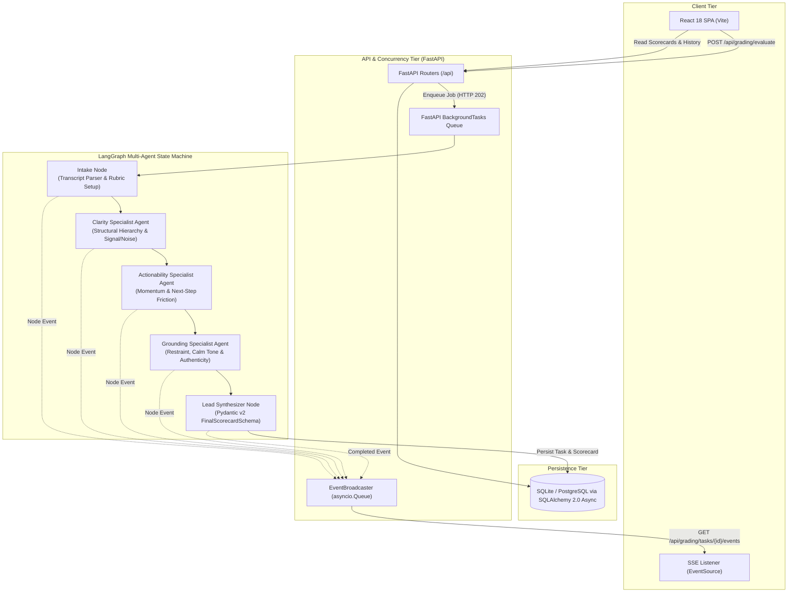

# Relay — Real-Time Multi-Agent AI Evaluation Engine

[](https://github.com/Jemade/Relay/actions/workflows/ci.yml)
[](https://www.python.org/downloads/)
[](https://fastapi.tiangolo.com)
[](https://github.com/langchain-ai/langgraph)
[](https://react.dev)
[](https://www.docker.com)
[](https://kubernetes.io)
[](LICENSE)

**Relay** is an asynchronous, multi-agent evaluation engine and interactive workspace designed for auditing and scoring human-AI conversational transcripts. Powered by a compiled **LangGraph** state machine, Relay orchestrates specialist evaluator agents off the HTTP request/response cycle, streaming node transitions in real time via **Server-Sent Events (SSE)** and generating structured, validated **Pydantic v2** scorecards.

---

## Architecture Overview



### Core Pipeline Design

1. **Non-Blocking Ingestion**: Transcripts are submitted to `/api/grading/evaluate` and assigned a persistent UUID task ID, returning `HTTP 202 Accepted` immediately so callers are never blocked.
2. **Sequential Multi-Agent Grading**:
   - **Intake Node**: Normalizes JSON turn arrays or plain-text scripts and instantiates rubric parameters.
   - **Clarity Evaluator**: Assesses structural formatting, typographical balance, readability indices, and signal density.
   - **Actionability Evaluator**: Measures forward momentum, handoff friction, and executable milestone clarity.
   - **Grounding & Calmness Evaluator**: Verifies restraint, absence of synthetic hype, and tone composure.
   - **Lead Synthesizer**: Reconciles weighted specialist findings into an authoritative `FinalScorecardSchema` including letter grade, momentum classification, and prioritized action items.
3. **Resilient Dual-Mode Evaluation**: Every evaluator supports live LLM inference with provider switching (OpenAI, Anthropic Claude, Google Gemini, custom endpoints) alongside deterministic lexical fallback scoring if an LLM is unreachable or rate-limited.
4. **Real-Time SSE Telemetry**: Progress transitions (`node_start`, `node_complete`, `pipeline_completed`) stream over Server-Sent Events to update the UI stepper with sub-second latency.

---

## Tech Stack

| Layer | Technologies |
|---|---|
| **Backend API** | Python 3.11, FastAPI, Uvicorn, Pydantic v2, Pydantic Settings |
| **Agent Orchestration** | LangGraph, LangChain Core, LangChain OpenAI, LangChain Anthropic, LangChain Google GenAI |
| **Database & ORM** | SQLAlchemy 2.0 (Async), aiosqlite (Local), asyncpg (PostgreSQL / Supabase) |
| **Frontend UI** | React 18, Vite 5, Vanilla CSS Design System (no heavy utility dependencies) |
| **Streaming & Async** | Server-Sent Events (SSE), Python `asyncio` Queue Broadcaster, Background Tasks |
| **Container & Cloud** | Docker (Multi-stage build), Docker Compose, Kubernetes, Render Blueprint (`render.yaml`) |
| **CI / CD** | GitHub Actions (Matrix testing, static frontend bundle check, Docker build verification) |

---

## Project Structure

```text
Relay/
├── .github/
│   └── workflows/
│       ├── ci.yml                 # Automated testing, frontend build & Docker verification
│       └── deploy.yml             # Continuous deployment workflow
├── backend/
│   ├── app/
│   │   ├── models/                # SQLAlchemy async ORM models (Thread, Message, GradingTask, Scorecard)
│   │   ├── pipeline/
│   │   │   ├── agents/            # Specialist agent implementations (Intake, Clarity, Actionability, etc.)
│   │   │   ├── graph.py           # Compiled LangGraph StateGraph definition
│   │   │   ├── llm_factory.py     # Provider-agnostic LLM initialization & fallback metrics
│   │   │   └── state.py           # TypedDict pipeline state contract
│   │   ├── queue/
│   │   │   ├── broadcaster.py     # Thread-safe asyncio event broadcasting for SSE
│   │   │   └── task_manager.py    # Background pipeline execution & state persistence
│   │   ├── routers/               # FastAPI routers (health, threads, grading)
│   │   ├── schemas/               # Pydantic v2 request/response schemas
│   │   ├── config.py              # Environment configuration & settings
│   │   ├── database.py            # Async engine and session management
│   │   └── main.py                # App entrypoint, CORS, and unified SPA serving
│   ├── tests/                     # Pytest suite covering API, schemas, and LangGraph pipeline
│   ├── requirements.txt           # Python dependencies
│   └── run.py                     # Local standalone backend launcher
├── frontend/
│   ├── src/
│   │   ├── components/            # Workspace, Conversation, Scorecard, Composer UI components
│   │   ├── services/              # API fetch client and SSE connection management
│   │   ├── App.jsx                # Main application orchestrator
│   │   └── index.css              # Custom responsive typography and theme stylesheets
│   ├── package.json
│   └── vite.config.js             # Vite configuration with backend API proxying
├── k8s/                           # Production Kubernetes manifests
│   ├── namespace.yaml
│   ├── configmap.yaml
│   ├── secret.example.yaml
│   ├── deployment.yaml
│   ├── service.yaml
│   ├── ingress.yaml
│   └── kustomization.yaml
├── Dockerfile                     # Multi-stage production container build
├── docker-compose.yml             # Local multi-container development environment
├── render.yaml                    # Render Infrastructure-as-Code Blueprint
├── pytest.ini                     # Pytest configuration
└── README.md                      # Engineering documentation
```

---

## Getting Started Locally

### Prerequisites

- **Python**: 3.11 or newer
- **Node.js**: 20 LTS or newer (`npm` 10+)
- **Git**

### 1. Clone & Setup Environment

```bash
git clone https://github.com/Jemade/Relay.git
cd Relay
```

### 2. Backend Setup

```bash
# Create and activate Python virtual environment
python -m venv backend/.venv

# On Linux / macOS:
source backend/.venv/bin/activate

# On Windows (PowerShell):
.\backend\.venv\Scripts\Activate.ps1

# Install dependencies
pip install -r backend/requirements.txt

# Run test suite to verify installation
pytest backend/tests -v
```

### 3. Frontend Setup

```bash
cd frontend
npm install
npm run build
cd ..
```

### 4. Running the Application

You can run Relay in two modes:

#### Option A: Unified Production Mode (FastAPI serves built React SPA)
```bash
# Ensure frontend is built (cd frontend && npm run build)
python -m uvicorn backend.app.main:app --host 0.0.0.0 --port 8000 --reload
```
Navigate to `http://localhost:8000` in your browser.

#### Option B: Independent Hot-Reloading Development
In Terminal 1 (Backend):
```bash
python -m uvicorn backend.app.main:app --host 127.0.0.1 --port 8000 --reload
```

In Terminal 2 (Frontend with Vite HMR):
```bash
cd frontend
npm run dev
```
Navigate to `http://localhost:3000`. API requests to `/api` are automatically proxied to port `8000`.

---

## Docker & Containerization

Relay uses a secure, multi-stage `Dockerfile`:
- **Stage 1 (`frontend-builder`)**: Compiles the React SPA using Node 20.
- **Stage 2 (`runtime`)**: Minimal Python 3.11-slim image that serves both the API and the static assets with non-root security privileges (`relayuser`).

### Run with Docker Compose

```bash
# Start the full stack with SQLite
docker compose up -d

# Check container health and logs
docker compose logs -f relay

# Tear down
docker compose down
```

### Run with PostgreSQL Profile

```bash
docker compose --profile with-postgres up -d
```

Access the application at `http://localhost:8000`.

---

## Kubernetes Orchestration

Production-ready manifests are located in `k8s/` and include health probes, resource quotas, and non-root execution profiles.

### Deploying to a Cluster

```bash
# 1. Create the namespace and resources using Kustomize
kubectl apply -k k8s/

# 2. Configure secrets (copy template first)
kubectl apply -f k8s/secret.example.yaml

# 3. Verify pod health and readiness
kubectl get pods -n relay -l app.kubernetes.io/name=relay

# 4. View deployment logs
kubectl logs -n relay -l app.kubernetes.io/name=relay -f
```

### Manifest Details

- **`deployment.yaml`**: 2 replicas, rolling updates (`maxSurge: 1`, `maxUnavailable: 0`), CPU/memory requests and limits, `livenessProbe` and `readinessProbe` pointing to `/api/health`.
- **`service.yaml`**: Exposes port 80 internally mapped to container port 8000.
- **`ingress.yaml`**: Ingress resource with custom Nginx proxy buffering rules optimized for long-lived Server-Sent Events (SSE).

---

## Cloud Deployment (Render Blueprint)

Relay includes a native `render.yaml` specification for automated zero-downtime deployment:

1. Fork or push this repository to your GitHub account.
2. Sign in to your [Render Dashboard](https://dashboard.render.com).
3. Click **New +** and select **Blueprint**.
4. Connect your repository. Render automatically reads `render.yaml`, configures the Docker web service, attaches a 1GB persistent disk at `/app/data` for SQLite, and activates the `/api/health` monitoring probe.
5. In the Render dashboard, supply your optional LLM API keys (`OPENAI_API_KEY`, `ANTHROPIC_API_KEY`, or `GOOGLE_API_KEY`).

---

## API Reference

### Health & Metrics

| Method | Endpoint | Description |
|---|---|---|
| `GET` | `/api/health` | Service status, database connectivity, and active LLM configuration |
| `GET` | `/api/metrics` | Real database aggregates (thread count, token usage, scorecard volume) |
| `POST` | `/api/settings/keys` | Dynamically update active LLM credentials and default provider |

### Grading & Multi-Agent Pipeline

| Method | Endpoint | Description |
|---|---|---|
| `POST` | `/api/grading/evaluate` | Submit a transcript for asynchronous multi-agent grading (HTTP 202) |
| `GET` | `/api/grading/tasks/{task_id}` | Poll current execution state and retrieve final scorecard |
| `GET` | `/api/grading/tasks/{task_id}/events` | SSE stream for real-time state machine step transitions |
| `GET` | `/api/grading/scorecards` | List historical consolidated scorecards |

#### Sample Evaluation Request
```bash
curl -X POST "http://localhost:8000/api/grading/evaluate" \
     -H "Content-Type: application/json" \
     -d '{
       "transcript_text": "User: How do we simplify the release workflow?\nAssistant: 1. Automate linting in CI.\n2. Use multi-stage Docker builds.\n3. Deploy via Kubernetes rolling updates."
     }'
```

#### Sample Response
```json
{
  "task_id": "41c888d3-5777-4952-b88d-e6b7f3efc174",
  "thread_id": null,
  "status": "queued",
  "created_at": "2026-09-10T13:45:00Z"
}
```

### Threads & Conversation Management

| Method | Endpoint | Description |
|---|---|---|
| `GET` | `/api/threads` | Fetch conversation threads with message counts |
| `POST` | `/api/threads` | Create a new conversation thread |
| `GET` | `/api/threads/{id}` | Fetch thread details and message history |
| `POST` | `/api/threads/{id}/messages` | Send message and receive AI response |
| `POST` | `/api/threads/{id}/regenerate`| Regenerate last assistant turn |
| `DELETE` | `/api/threads/{id}` | Delete thread and associated scorecards |

---

## Testing & Quality Assurance

Run the automated test suite with pytest:

```bash
pytest backend/tests -v
```

The test suite validates:
- **`test_api.py`**: End-to-end integration tests for `/api/health`, thread CRUD, background grading task initiation, and polling completion.
- **`test_grading_graph.py`**: Direct execution of the compiled LangGraph pipeline validating state mutations and scorecard assertions.
- **`test_schemas.py`**: Pydantic v2 validation logic, rubric scoring bounds (0–100), and schema serialization.

---

## Resume & LinkedIn Highlights

Looking to showcase this project on your LinkedIn profile or software engineering resume? Here are production-focused descriptions ready to use:

### LinkedIn Project Description
> **Relay — Real-Time Multi-Agent AI Evaluation Platform**
> - Designed and built an asynchronous, cloud-native evaluation engine that audits conversation quality using a 5-node compiled **LangGraph** multi-agent pipeline.
> - Engineered a non-blocking background queue with **FastAPI** and implemented real-time node state telemetry using **Server-Sent Events (SSE)**.
> - Implemented a resilient dual-mode evaluation architecture supporting multi-provider LLM inference (OpenAI, Anthropic, Gemini) with zero-downtime deterministic lexical fallback scoring.
> - Architected a multi-stage **Docker** build and **Kubernetes** manifests with rolling deployment strategies, health probes, and Nginx SSE ingress rules.
> - Configured end-to-end **GitHub Actions** CI/CD pipelines for automated testing, bundle compilation, and container verification.

### Resume Bullet Points
- **AI Systems & Backend Engineering**: Architected an asynchronous AI evaluation platform with FastAPI, SQLAlchemy 2.0 Async, and LangGraph, decoupling evaluation execution from the request cycle with sub-second SSE streaming.
- **Multi-Agent Orchestration**: Built a modular pipeline of specialist evaluators (Clarity, Actionability, Grounding) orchestrated into a single Pydantic v2 scorecard with automated lexical fallback resilience.
- **Cloud-Native & DevOps**: Containerized the application via multi-stage Docker builds (reducing image size to slim runtime), authored Kubernetes manifests (Deployments, Services, ConfigMaps, Ingress), and set up GitHub Actions CI/CD with Render Blueprint deployment.

---

## License

This project is licensed under the MIT License — see the [LICENSE](LICENSE) file for details.
